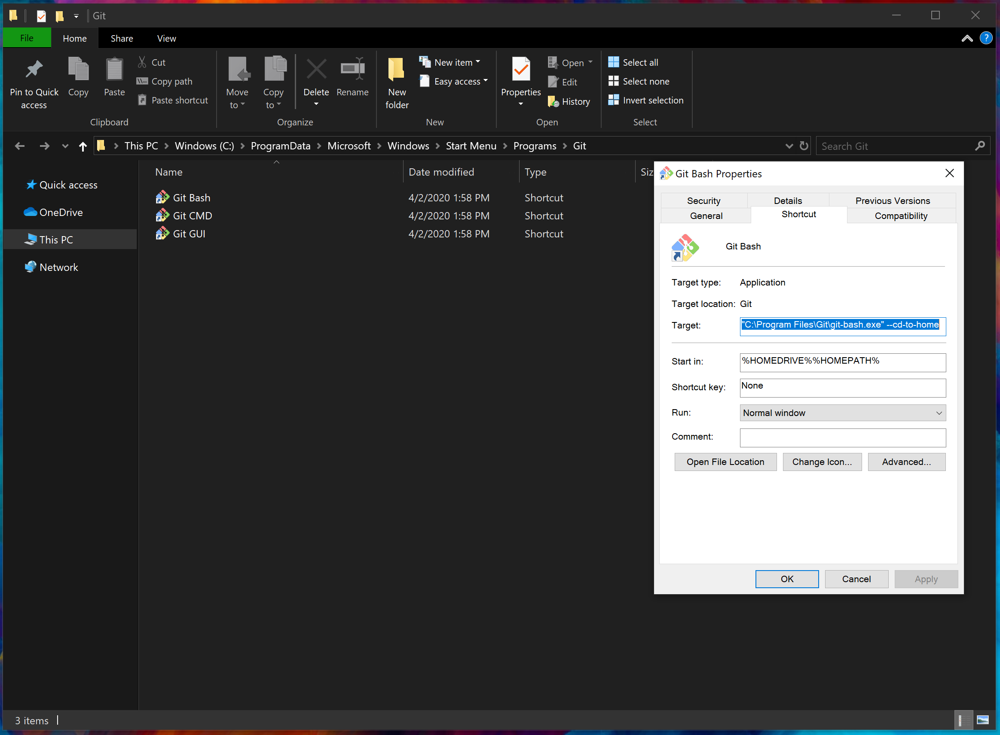
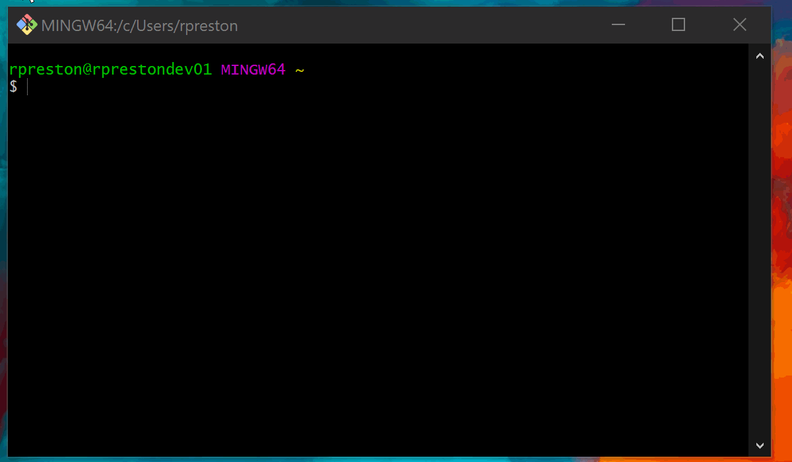

# Git 101
A quick run down to get you up to speed with Git. There is also a handy [Git Cheetsheet](./media/Git-Cheatsheet.pdf) pulled from [Atlassian](https://www.atlassian.com/) which has a lot of useful tutorials and resources.

 - [Installing Git](#installing-git)
 - [Configuration](#configuration)
 - [Terminology](#terminology)

## Installing Git
These are steps on how to install git for each operating system.

### On Windows
Download Git for Windows from [here](https://git-scm.com/downloads). Once downloaded, run the installer with administrator privileges and process through the installer as below.

*Note:* Feel free to choose your preferred option for the text editor. [VSCode](https://code.visualstudio.com/) is a user friendly and popular option if you're not sure what to pick.


Once the installer has finished, we recommend setting the Git Bash to start up in your home directory. This is accomplished by navigating to the shortcut properties, and appending  ```--cd-to-home``` after the last quotation mark in the Target field.




### On Linux
Open up the terminal and run the command: ```sudo apt get install git``` enter the sudo password if required, and when asked whether you want to install git, enter ```y``` for yes.

### On Mac
TBA

## Configuration
This section has various configuration options.

### Git Config User Info
First step is setting up your name and username in git. So open Git Bash (or terminal on linux or mac), which acts nominally the same as a linux terminal, and then enter the two lines below, replacing the NAME and EMAIL with your information.

```
    git config --global user.name NAME
    git config --global user.email EMAIL
```

### SSH Key Linking
TBA

### Organizing Your Repositories
Once that's complete, you'll want a directory to store all your repositories in. This can be created from the command line using the ```mkdir``` command.

You can see all the files and folders in the current directory with the ```ls``` command. Then, you'll want to go into the newly made folder using the ```cd``` command.



## Terminology

 - *Repository:* A git project. Each repository, or repo, is a folder that contains its own version history. This repo can be a single piece of code, a larger multi-system project, or really anything you want to put in a folder.
 - *Clone:* A clone is a local copy of a repository. To get a local copy of a remote repo, you complete a clone command.
 - *Fork:* A fork is how you make your own centralized, separate copy of someone else's repo for you to make changes to.
 - *Commit:* A commit is a snapshot of changes to the code. Each commit has a message and a unique id string, so you can see all commits in the repo's history.
 - *Branch:* Repositories have branches, such as main, or borked-fix-13 that allow developers to branch off the history of the code to work on individual issues or improvements, without changing whatever the core or release level code base is. These issues can then be *merged* back into the code at a later point.
 - *Push:* When you push, you are telling the system to take your local changes to the repo (or commits) to the remote origin where the data is housed/backed up. This is normally either [github](https://github.com) or [gitlab](https://gitlab.com).
 - *Pull:* When you pull, you are telling the system to take changes that have been applied to the remote system, and copy them down into your local repository. If you have any local changes then they could be lost, or the system might ask you to complete a merge of your history with the remote history, which gets... More complicated.
 - *Pull request:* A pull request is how you ask someone else to bring in changes from your forked repo to the original or higher level copy of the project.

## Interacting with Remote Repositories
Next up is remote repositories. A remote repository could be any repository that is not your "local" respository. A remote repository is basically a pointer to another instance of the repository, and could even be on the same machine!

### Create a Remote Repo
To link to the remote repository that would be your "originator" repository, you would run the following command in git bash in your local repository.

```
git remote add origin REMOTE_URL
```

This command says to add a new remote repository link named "origin" at the location "REMOTE_URL". This sets the link from the local repository. The next step is then to complete a first push to the empty remote repository.

This first push of any new local branch is different from normal push and pull behavior described further down, because it sets up tracking linking to the remote repository.

```
git push -u origin master
```

This command tells git to push the changes from your current local version of the branch "master" upstream to the remote repository "origin" which will upload your changes, and setup this branch on the remote repository to match your local version.

### Cloning a Remote Repo
Cloning a repository by comparison is relatively straightforward. You get the link to an existing repository, whether that is on the local machine or a github server makes no difference except in how you obtain the link. For github you would go to the repository's page and press the "clone" button on the right hand side, which provides a copy-able link.

Once you have your link, in git bash, navigate to the directory where you would like to place your repository directory (i.e. your "Repos" or "Source" folder), and run the following code snippet, replacing "REMOTE_URL" with the repository link.

```
git clone REMOTE_URL
```

This will create a new folder in your current folder that has the repository name. Navigate into that folder, and you're ready to start working.

### Push and Pull Updates to Remote
Once you've set up your remote repository, either by creating or cloning, you can start working. The next step is to stay in sync with the remote repository via pushing and pulling.

*Pushing* is the act of updating the remote branch with any changes you have commit on the local branch. Keep in mind that if the remote branch has changes that you do not have locally integrated, the push action will fail. The command to push is:

```
git push origin master
```

Where "origin" is the remote repository and "master" is the remote branch to push to. Realize that if you have synced your current branch and repository to upstream using the -u from earlier, you can simplify this command to simply be git push and get the same behavior.

*Pulling* is the act of updating your local branch with any updates that are on the remote repository. When you pull git will automatically try to merge the remote updates with any changes from the remote branch using internal difference logic. If you have any changes that have not been commit that would be overwritten, git will instead cancel the pull, and tell you to either commit or stash those changes before pulling. If you have changes that you have commit, git will try to automatically merge those changes. If both your local commits and the remote commits change the same section of code, git wil place labeled versions of both code, and ask you to review the files, set them up with the correct version, and then commit the changes as part of a manual merge commit. The command to pull is:

```
git pull origin master
```

Where "origin" is the remote repository and "master" is the remote branch to pull from. Realize that if you have synced your current branch and repository to upstream using the -u from earlier, you can simplify this command to simply be git pull and get the same behavior.

*Note:* Best practices on pushing and pulling in a project where multiple people are making changes is to use branches to keep your work separate, and only merge into the main branch when the changes from the side branch have been completed. If major changes to the primary branch occur while still working on the side branch, these changes should be pulled into the side branch and integrated locally, but this will keep from needing constant small merges and push conflicts.


